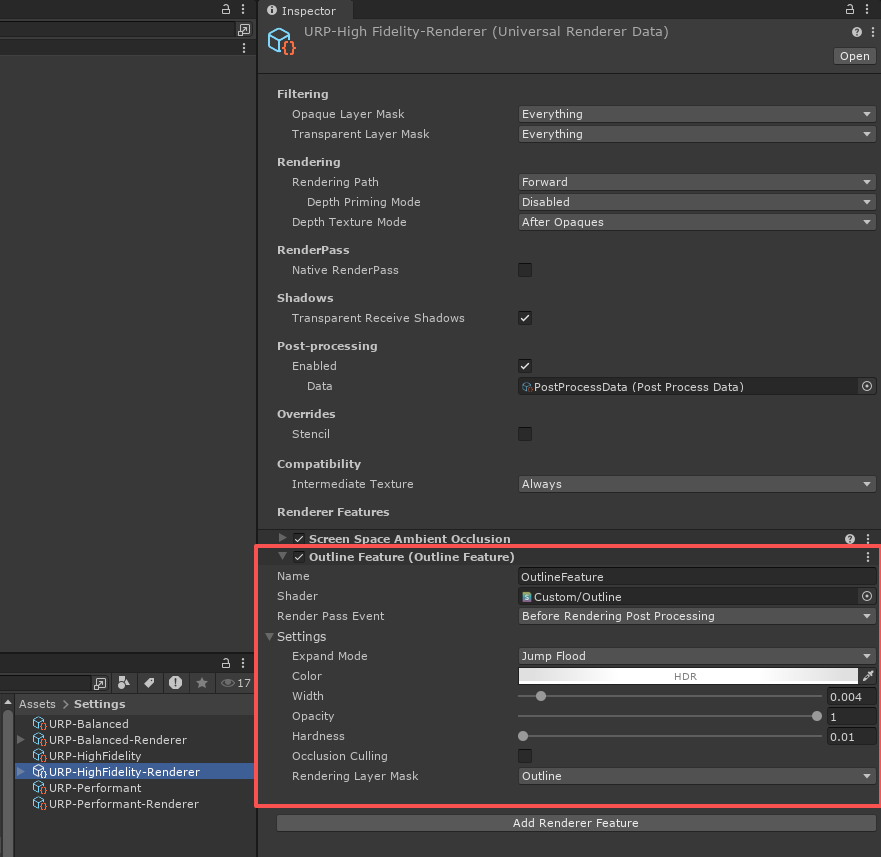
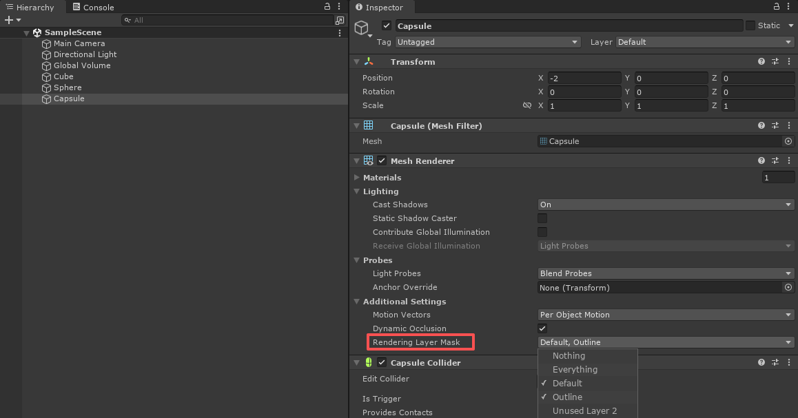
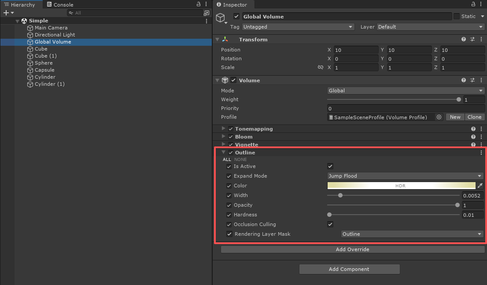
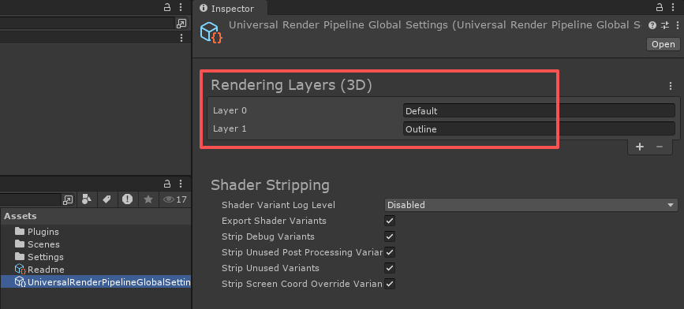

# Unity URP Outline

<p align="center">
  
  
  
  
</p>

<p align="center">
  🌍
  中文 |
  <a href="./README_EN.md">English</a> |
  <a href="./README_JA.md">日本語</a>
</p>

<p align="center">
  📥
  <a href="#安装">安装</a> |
  <a href="#下载">下载</a>
</p>

## 简介
本项目基于 **Unity 2022.3.62f3** 的 **URP (14.0.12)** 渲染管线实现了一种外描边效果。  
Shader 通过 **UV 采样与卷积计算** 达成描边渲染。  
描边功能已封装为 **UPM 包**（`com.fs.outline`），可直接安装到你自己的 URP 项目中使用。


## 安装
描边功能位于仓库子目录 `Assets/Plugins/FsOutline`，已封装为 UPM 包，依赖 **Universal RP 14.0.12**（`com.unity.render-pipelines.universal`）。请先确保你的项目已启用 URP。

### 方式一：作为 UPM 包安装（推荐）
在你的项目中打开 **Window → Package Manager**，点击左上角 **[+] → Add package from git URL**，输入以下地址：

```
https://github.com/blurfeng/unity-urp-outline.git?path=/Assets/Plugins/FsOutline
```

> 💡 可在 URL 末尾追加 `#<分支或标签>` 锁定版本，例如 `...FsOutline#main`。

### 方式二：克隆整个仓库作为示例工程
本仓库本身就是一个配置完整的示例工程。克隆后用 **Unity 2022.3.62f3** 打开，即可查看完整的描边配置与演示场景。

```
git clone https://github.com/blurfeng/unity-urp-outline.git
```

## 下载
除通过 UPM 安装外，你也可以从 GitHub Releases 下载安装包手动导入。

前往 [Releases](https://github.com/blurfeng/unity-urp-outline/releases) 页面，下载最新版本的 `.unitypackage`，然后在 Unity 中通过 **Assets → Import Package → Custom Package...** 选择该文件导入即可。

> 💡 手动导入的包不会随仓库自动更新，如需版本管理建议优先使用上方的 UPM 方式。

## 使用方式
本项目已完成基础配置，你可以直接参考使用，或按照以下步骤将描边效果集成到自己的项目中。

### 1. 添加 Renderer Feature
在当前使用的 **Universal Renderer Data** 中，点击 **[Add Renderer Feature]** 按钮，添加外描边的 Renderer Feature。  
在 Inspector 中配置参数，其中 **Rendering Layer Mask** 决定了哪些渲染层的对象会被描边。



### 2. 设置渲染目标物体的 Rendering Layer Mask
在目标物体的 **Mesh Renderer → Additional Settings → Rendering Layer Mask** 中，设置其渲染层。  
将渲染层与 Renderer Feature 中的 **Rendering Layer Mask** 对应起来，即可生效。  

🎉 配置完成后，你将看到物体的描边效果。



### 3. 通过 Volume 在运行时修改描边参数
如果需要在运行时修改描边效果，可以在 **Volume** 中添加 **Outline** 组件并启用覆盖。  
此时 Volume 中的配置会覆盖 Renderer Feature 上的默认设置。



## 支持的参数
- **HDR 颜色**：描边使用的高动态范围颜色，可呈现发光效果。  
- **描边宽度**：基于 UV 采样实现。若宽度过大，可能在直角或规则形状处出现穿帮现象。  
- **渲染层遮罩**：通过渲染层遮罩控制哪些物体会被描边。  

## Rendering Layers 渲染层说明
URP 提供了 **Rendering Layers** 来控制和区分渲染层。  
**建议使用 Rendering Layers 而不是 Unity 内置的 Layer**，原因如下：

- **Layer** 同时涉及物理碰撞、摄像机裁剪等功能，与描边混用可能导致冲突。  
- **Rendering Layers** 独立于物理和逻辑，配置更清晰、更专一。  

你可以在 **Universal Render Pipeline Global Settings** 中配置 **Rendering Layers**：  



✅ **渲染层自动读取**  
本包会从当前生效的 **URP 资产** 自动读取已配置的 Rendering Layers 名称。  
配套的 `RenderingLayerMaskDrawer` 会把渲染层遮罩绘制成勾选式下拉框，选项即为上方 Global Settings 中配置的渲染层。  
因此你对 Rendering Layers 的任何增删改都会自动反映到选项中，无需再手动同步任何脚本。  