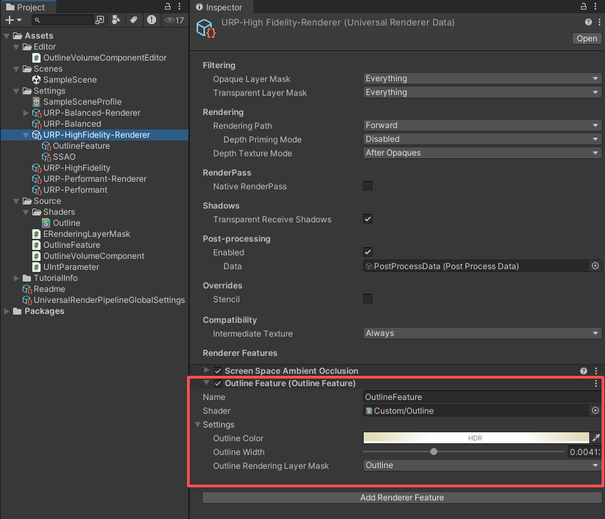
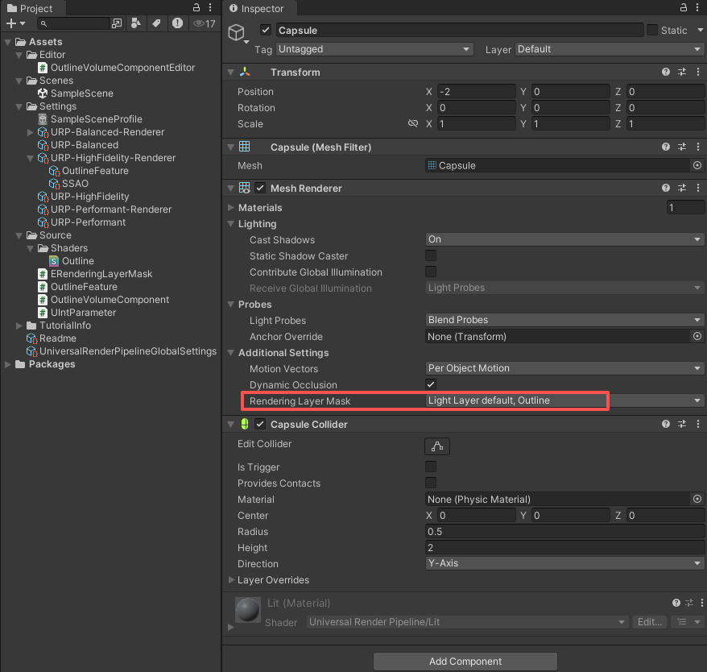

# 【Unity URP Outline】
---

### ***阅读中文文档 > [中文](README.md)***
### ***Read this document in > [English](README_en.md)***
### ***日本語のドキュメントを読む > [日本語](README_ja.md)***

---

## 【项目简介】
本项目基于 **Unity 2022.3.62f1** 的 **URP (14.0.12)** 渲染管线实现了一种外描边效果。  
Shader 通过 **UV 采样与卷积计算** 达成描边渲染。

## 【使用方式】
本项目已完成基础配置，你可以直接参考使用，或按照以下步骤将描边效果集成到自己的项目中。

### 1. 添加 Renderer Feature
在当前使用的 **Universal Renderer Data** 中，点击 **[Add Renderer Feature]** 按钮，添加外描边的 Renderer Feature。  
在 Inspector 中配置参数，其中 **Rendering Layer Mask** 决定了哪些渲染层的对象会被描边。

### 2. 设置渲染目标物体的 Rendering Layer Mask
在目标物体的 **Mesh Renderer → Additional Settings → Rendering Layer Mask** 中，设置其渲染层。  
将渲染层与 Renderer Feature 中的 **Rendering Layer Mask** 对应起来，即可生效。  

🎉 配置完成后，你将看到物体的描边效果。

### 3. 通过 Volume 在运行时修改描边参数
如果需要在运行时修改描边效果，可以在 **Volume** 中添加 **Outline** 组件并启用覆盖。  
此时 Volume 中的配置会覆盖 Renderer Feature 上的默认设置。

## 【支持的参数】
- **HDR 颜色**：描边使用的高动态范围颜色，可呈现发光效果。  
- **描边宽度**：基于 UV 采样实现。若宽度过大，可能在直角或规则形状处出现穿帮现象。  
- **渲染层遮罩**：通过渲染层遮罩控制哪些物体会被描边。  

## 【Rendering Layers 渲染层说明】
URP 提供了 **Rendering Layers** 来控制和区分渲染层。  
**建议使用 Rendering Layers 而不是 Unity 内置的 Layer**，原因如下：

- **Layer** 同时涉及物理碰撞、摄像机裁剪等功能，与描边混用可能导致冲突。  
- **Rendering Layers** 独立于物理和逻辑，配置更清晰、更专一。  

你可以在 **Universal Render Pipeline Global Settings** 中配置 **Rendering Layers**：  

⚠️ **注意事项**  
目前 URP 并未提供从代码中直接读取 `UniversalRenderPipelineGlobalSettings.RenderingLayers` 的方式。  
因此本项目使用了自定义脚本 **`ERenderingLayerMask`** 来控制渲染层。  
使用时，请确保该脚本的设置与 **Rendering Layers 配置** 保持一致。  