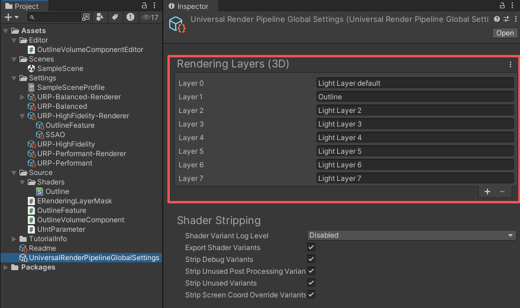

# 【Unity URP Outline】
---

### ***阅读中文文档 > [中文](README.md)***
### ***Read this document in > [English](README_en.md)***
### ***日本語のドキュメントを読む > [日本語](README_ja.md)***

---

## Project Overview
This project implements an outline effect based on **Unity 2022.3.62f1** with the **URP (14.0.12)** rendering pipeline.  
The shader achieves the outline effect using **UV sampling and convolution calculation**.

## How to Use
This project has already been preconfigured. You can use it directly or follow the steps below to integrate the outline effect into your own project.

### 1. Add Renderer Feature
In the **Universal Renderer Data** you are using, click the **[Add Renderer Feature]** button and add the Outline Renderer Feature.  
In the Inspector, configure the parameters. The **Rendering Layer Mask** determines which rendering layer objects will have outlines.

### 2. Set the Rendering Layer Mask for Target Objects
In the target object's **Mesh Renderer → Additional Settings → Rendering Layer Mask**, assign its rendering layer.  
Match the rendering layer to the **Rendering Layer Mask** set in the Renderer Feature.  

🎉 Once configured, you will see the outline applied to the object.

### 3. Modify Outline Parameters at Runtime with Volume
If you want to modify the outline effect at runtime, add an **Outline** component to a **Volume** and enable overrides.  
The settings in the Volume will then override the default configuration on the Renderer Feature.

## Supported Parameters
- **HDR Color**: The outline color in HDR, which can also create glowing effects.  
- **Outline Width**: Implemented via UV sampling. Large widths may cause artifacts, especially around sharp corners or square edges.  
- **Rendering Layer Mask**: Controls which objects are outlined through rendering layers.  

## Rendering Layers Explanation
URP provides **Rendering Layers** to control and distinguish rendering layers.  
It is **recommended to use Rendering Layers instead of Unity's built-in Layer**, for the following reasons:

- **Layer** is also used for physics collisions, camera culling, and other features, which may cause conflicts when mixed with outlines.  
- **Rendering Layers** are independent of physics and logic, making the configuration clearer and more focused.  

You can configure **Rendering Layers** in the **Universal Render Pipeline Global Settings**:  

⚠️ **Note**  
Currently, URP does not provide a way to directly read `UniversalRenderPipelineGlobalSettings.RenderingLayers` in code.  
Therefore, this project uses a custom script **`ERenderingLayerMask`** to manage rendering layers.  
When using it, please ensure the script configuration is kept consistent with the **Rendering Layers settings**.  