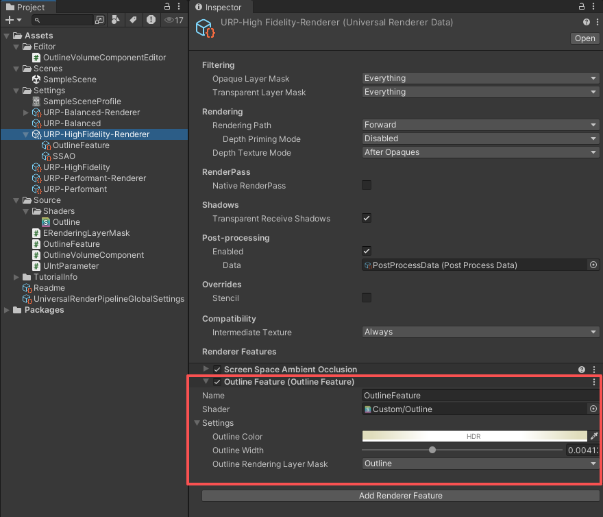
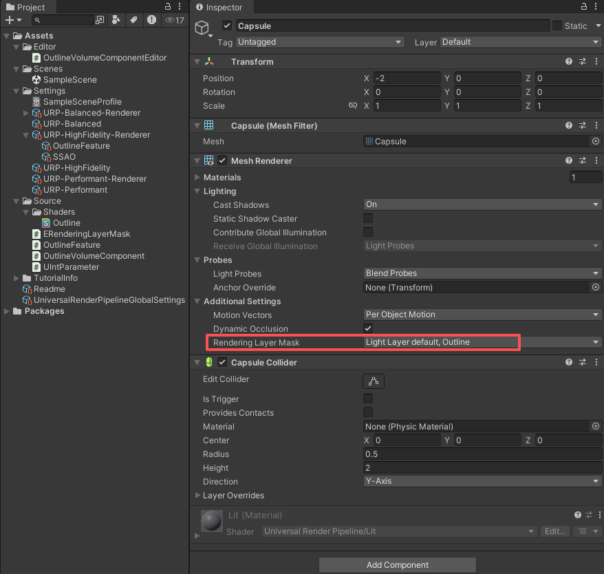
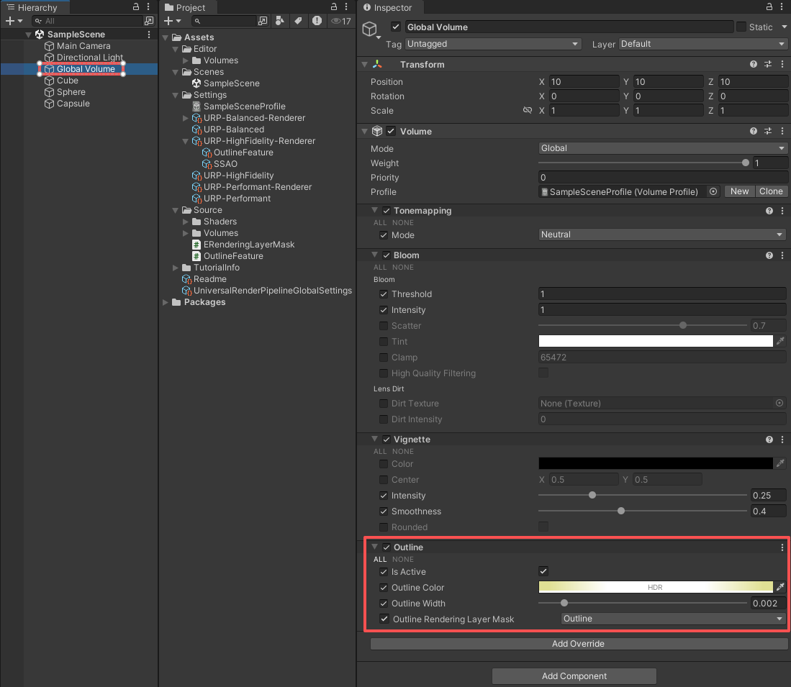
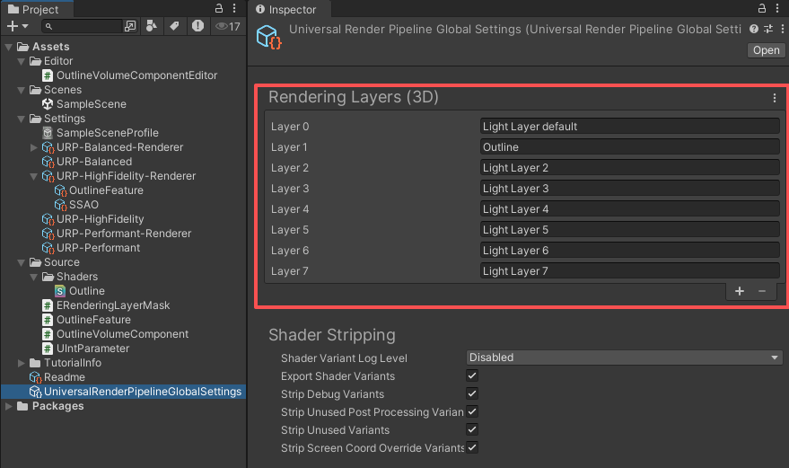

# 【Unity URP Outline】
---

### ***阅读中文文档 > [中文](README.md)***
### ***Read this document in > [English](README_en.md)***
### ***日本語のドキュメントを読む > [日本語](README_ja.md)***

---

## プロジェクト概要
本プロジェクトは **Unity 2022.3.62f1** の **URP (14.0.12)** レンダリングパイプラインを用いて、アウトライン効果を実装しています。  
Shader は **UV サンプリングと畳み込み計算** によりアウトラインを描画します。

## 使用方法
本プロジェクトはすでに基本設定済みです。直接利用することもできますし、以下の手順で自身のプロジェクトに統合することも可能です。

### 1. Renderer Feature を追加
使用中の **Universal Renderer Data** で **[Add Renderer Feature]** ボタンをクリックし、Outline Renderer Feature を追加します。  
Inspector でパラメータを設定してください。**Rendering Layer Mask** により、どのレンダリングレイヤーのオブジェクトがアウトライン描画されるかが決まります。

### 2. 描画対象オブジェクトの Rendering Layer Mask を設定
対象オブジェクトの **Mesh Renderer → Additional Settings → Rendering Layer Mask** でレンダリングレイヤーを設定します。  
Renderer Feature の **Rendering Layer Mask** に対応するレイヤーを指定してください。  

🎉 設定が完了すると、オブジェクトにアウトラインが表示されます。

### 3. Volume による実行時のアウトライン設定変更
実行時にアウトライン効果を変更したい場合は、**Volume** に **Outline** コンポーネントを追加し、Override を有効化します。  
この場合、Volume の設定が Renderer Feature のデフォルト設定を上書きします。

## サポートされるパラメータ
- **HDR カラー**：アウトラインに使用する HDR カラー。発光効果も表現可能です。  
- **アウトライン幅**：UV サンプリングによって実装。幅を大きくすると、直角や四角形のエッジ部分で破綻が発生する可能性があります。  
- **レンダリングレイヤーマスク**：アウトラインを描画するオブジェクトをレンダリングレイヤーで制御します。  

## Rendering Layers の説明
URP では **Rendering Layers** を用いてレンダリングレイヤーを制御・区別することができます。  
**Unity の標準 Layer ではなく Rendering Layers を使用することを推奨** します。その理由は以下の通りです：

- **Layer** は物理衝突やカメラカリングなどにも使用されるため、アウトライン処理と混用すると競合が発生する可能性があります。  
- **Rendering Layers** は物理やロジックから独立しているため、設定がより明確でシンプルになります。  

**Universal Render Pipeline Global Settings** で **Rendering Layers** を設定できます：  

⚠️ **注意**  
現在、URP には `UniversalRenderPipelineGlobalSettings.RenderingLayers` をコードから直接取得する方法がありません。  
そのため、本プロジェクトではカスタムスクリプト **`ERenderingLayerMask`** を用いてレンダリングレイヤーを制御しています。  
使用する際は、スクリプトの設定と **Rendering Layers の設定** を一致させるようにしてください。  